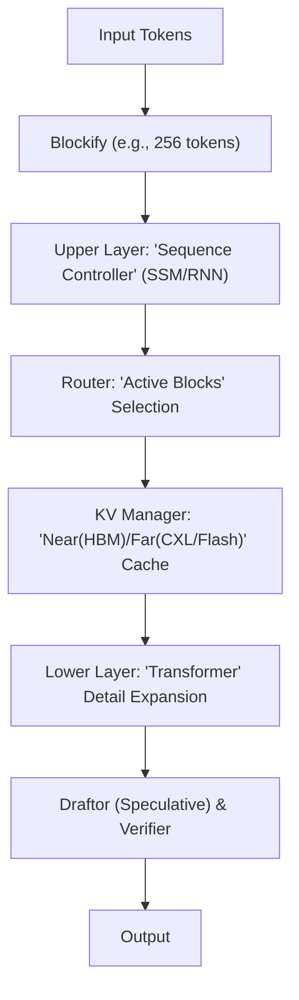

# Resonanceverse：2階建てアーキテクチャ実装計画 v0.1

> 下層＝Transformer（資産を活かす）／上層＝新アーキ（骨格化・活性スパース・階層キャッシュ）。
> 目的：**等品質で Transformer 単体より軽く速く**を実証（HBM_bytes/token・Joules/token・p95 latency）。

---

## 1. 目的関数（Objective）

* 最小化：`HBM_bytes/token`, `Joules/token`, `Latency(p50/p95)`
* 制約：`Quality ≥ τ`（ベンチマークで±0.1σ以内）、`Stability ≥ σ`（学習の再現性と収束安定）、`Reproducibility ≥ ρ`
* スコア例：

  * **等品質比較**：品質を固定し、資源指標の比を報告（例：HBM_bytes/token=0.58×）。
  * **等資源比較**：資源を固定し、品質差を報告（例：Exact Match +0.2pt）。

---

## 2. 全体像（Two-Tier Design）



> Mermaidルール：flowchart TD、ラベルは必ず**二重引用符**で囲む（スラッシュや括弧を含むため）。

---

## 3. アーキテクチャ詳細

### 3.1 上層（Sequence Controller / Router / KV Manager / Draftor）

* **Sequence Controller**：小型SSM（Mamba系）または軽量RNN。

  * 役割：ブロック列から**粗い骨格表現**（coarse state）と**優先度 p∈[0,1]**を生成。
* **Router**：`p > τ` のブロックのみを下層へ送る**活性スパース化**。

  * 監視：最大スキップ率、再検証頻度の上限（安全装置）。
* **KV Manager**：ブロック優先度と再利用距離に基づく**階層キャッシュ**（近傍=HBM、遠方=CXL/Flash）。

  * ポリシー：先読み窓・ミス時ペナルティ学習・温度付き退避。
* **Draftor（任意）**：スペキュレイティブデコーディングの“下描き器”。本線で検証しミスを破棄。

### 3.2 下層（Transformer）

* 既存モデルを基本保持。FlashAttention等の**IO-aware最適化**はON。
* 重みは**凍結**または**LoRA/Adapter**で軽く追従。

---

## 4. データ構造（仮想アーキテクチャ）

* **ブロック表現**：`B_i = tokens[i:i+K]`（例：K=256）。
* **骨格状態**：`S_i = Controller(B_i)`（低次元、近接再利用に強い）。
* **活性集合**：`A = { i | p_i > τ }` のみ詳細展開。
* **キャッシュ階層**：`KV_near(HBM)` と `KV_far(CXL/Flash)` をブロック優先度で再配置。

---

## 5. 学習レシピ（壊さず積む）

### 5.1 蒸留（Teacher = フルTransformer）

* 目的関数：`L = L_ce + λ·L_feature + μ·L_route`

  * `L_feature`：骨格状態が下層中間（例：キー/バリュー統計・最終層表現）に近似。
  * `L_route`：Routerの選択が**“勾配寄与の大きいブロック”**に一致。

### 5.2 上層先行チューニング（弱教師）

* 長文・冗長文コーパスで、章見出しや段落境界、参照リンクを**骨格ラベル**として利用。

### 5.3 全体微調整（低精度前提）

* FP8/INT4運用を前提に、学習時から `HBM_bytes/token` をログ化し、帯域を**一次市民**として最適化。

---

## 6. 推論パス（運用時）

1. 入力をブロック化。
2. Controllerが各ブロックに `S_i, p_i` を付与。
3. Routerが `p_i > τ` を下層へ送り、その他はスキップ or 低精度推定。
4. KV Managerが `p_i` に基づきKVを近傍/遠方に再配置（先読み・退避）。
5. Draftorが下描き→下層で検証・確定。

---

## 7. 計測と評価（“勝った”を明確に）

### 7.1 指標

* **品質**：MMLU/BBH/LongBench/Code系＋社内実タスク。
* **効率**：`HBM_bytes/token`（必須）、`Joules/token`（推奨）、`Latency p50/p95`。
* **長文耐性**：128k/256kでの位相図（どこで優位が立ち上がるか）。

### 7.2 HBMバイト予算表（テンプレ）

> baseline（Transformer単体）と two-tier（本方式）の**2枚**を作り、差分でどこが効いたかを可視化。

| レイヤ                   | 前進IO(B) | 中間(B) | 逆伝播IO(B) | 再利用距離 | 触媒(最適化)   | 削減見込% |
| --------------------- | ------: | ----: | -------: | ----: | --------- | ----: |
| Embedding             |         |       |          |       |           |       |
| Attention_QKV         |         |       |          |       | FlashAttn |       |
| Attention_Score       |         |       |          |       |           |       |
| Attention_Softmax     |         |       |          |       |           |       |
| Attention_WeightedSum |         |       |          |       |           |       |
| FFN_1                 |         |       |          |       |           |       |
| FFN_2                 |         |       |          |       |           |       |
| Norm/Residual         |         |       |          |       |           |       |
| Optimizer/State       |         |       |          |       |           |       |
| 通信(collective)        |         |       |          |       | overlap   |       |
| **合計**                |         |       |          |       |           |       |

**CSVテンプレ**

```csv
layer,fwd_io_b,act_b,bwd_io_b,reuse_distance,optimization,expected_reduction_pct
Embedding,,,,,,
Attention_QKV,,,,,FlashAttention,
Attention_Score,,,,,,
Attention_Softmax,,,,,,
Attention_WeightedSum,,,,,,
FFN_1,,,,,,
FFN_2,,,,,,
Norm_Residual,,,,,,
Optimizer_State,,,,,,
Collective_Comm,,,,,overlap,
TOTAL,,,,,,
```

### 7.3 アブレーション計画

* Router OFF／KV階層化 OFF／Draftor OFF／Controller差替え（SSM↔RNN）。
* 等品質・等資源の**両軸**で比較し、部品別の寄与％を算出。

**殺し文句（例）**

> 128kトークン推論で **HBM_bytes/token 0.58×**, 品質同等, p95レイテンシ **0.75×**

---

## 8. スプリント計画（初動4週間想定）

### Sprint 1（MVP）

* Controller=SSM小型、K=256ブロック化、弱教師Router。
* KV Manager=二層（HBM/DRAM or CXL）＋先読み窓。
* ベンチ：LongBench 2–3タスク＋社内1本。
* 成果物：HBM予算表（baseline/2階建て）、最初の差分グラフ。

### Sprint 2（引き締め）

* Draftor導入、LoRA微調整、アブレーション一式。
* 成果物：**Execution Card v0.1**（下記テンプレ）と“殺し文句”一本化。

---

## 9. 失敗モードと安全装置

* **Router誤選択**：品質低下 → 閾値で**強制全展開**フォールバック。
* **上層過学習**：分布外破綻 → 最大スキップ率・再検証頻度に上限。
* **階層キャッシュ揺れ**：CXL/Flash遅延波 → 先読み窓＋ミス時ペナルティ学習。
* **数値安定性**：低精度で崩れ → スケール正規化・損失クリッピング・mixed precision safelist。

---

## 10. リポ構成（雛形）

```
resonanceverse/
  runtime/              # KV層・Router・Draftor 実装
  models/
    controller_ssm/     # 上層（SSM/RNN）
    transformer_base/   # 下層（凍結 or LoRA）
  training/
    distill.py          # 蒸留エントリ
    weaklabels.py       # 弱教師生成
  profiling/
    hbm_budget.py       # 予算表＆トレース
  eval/
    longbench.py
    ablation.py
  docs/
    execution_card.md   # 目的関数・位相図・殺し文句
```

---

## 11. APIスケッチ（擬似コード）

```python
class Controller(nn.Module):
    def forward(self, blocks):
        # blocks: [N_blocks, K, d]
        # returns: states [N_blocks, d_s], priority p [N_blocks]
        ...

class Router:
    def select(self, states, p, tau):
        # returns indices of active blocks
        ...

class KVManager:
    def place(self, kv_tensors, priority):
        # near (HBM) vs far (CXL/Flash) + prefetch scheduling
        ...

def two_tier_infer(tokens):
    blocks = blockify(tokens, K=256)
    S, p = controller(blocks)
    active = router.select(S, p, tau)
    kv_near, kv_far = kv_manager.allocate(active, p)
    draft = draftor.generate(blocks, S, p)
    out = transformer.verify(draft, kv_near, kv_far)
    return out
```

---

## 12. Execution Card v0.1（テンプレ）

```text
# Execution Card – Resonanceverse Two-Tier v0.1

Objective:
  - Minimize: HBM_bytes/token, Joules/token, p95 latency
  - Subject to: Quality ≥ τ (±0.1σ), Stability ≥ σ, Repro ≥ ρ

Workload:
  - Datasets/Tasks: LongBench-X, Internal-Task-Y
  - Context Lengths: 32k, 128k, 256k

Model Stack:
  - Upper: SSM(R=...), Router(tau=...), KV(two-tier, window=...)
  - Lower: Transformer(Base=..., FlashAttn=ON, LoRA r=...)

Metrics:
  - Baseline vs Two-Tier (equal-quality / equal-resource)
  - HBM budget tables (per-layer, per-block)

Phase Diagram:
  - Advantage onset by {length, sparsity, domain}

Killer Claim:
  - e.g., 128k: HBM_bytes/token 0.58× @ ΔQuality≤0.0x, p95 0.75×

Risks & Guards:
  - Router fallback, max skip rate, prefetch penalty, mixed-precision safelist
```

---

## 13. 次アクション（今日からできる）

1. 社内長文ワークロード1本を選定（評価ゴールを決める）。
2. **HBM予算表（baseline）**にサイズを埋める（層ごとの入出力・中間）。
3. Sprint 1の実装（SSM小型＋弱教師Router＋二層KV）で**差分測定**。
4. Sprint 2でDraftor/LoRA/アブレーションを回し、“殺し文句”を一本に絞る。

---

> 結論：**“詩（アルゴリズム）に合う韻律（アーキテクチャ）を与える”**——その第一歩が、Resonanceverseの2階建て。最初の勝利条件は「同等品質で軽い」。指標はFLOPsではなく**HBMバイト**で語る。ここから着手する。
