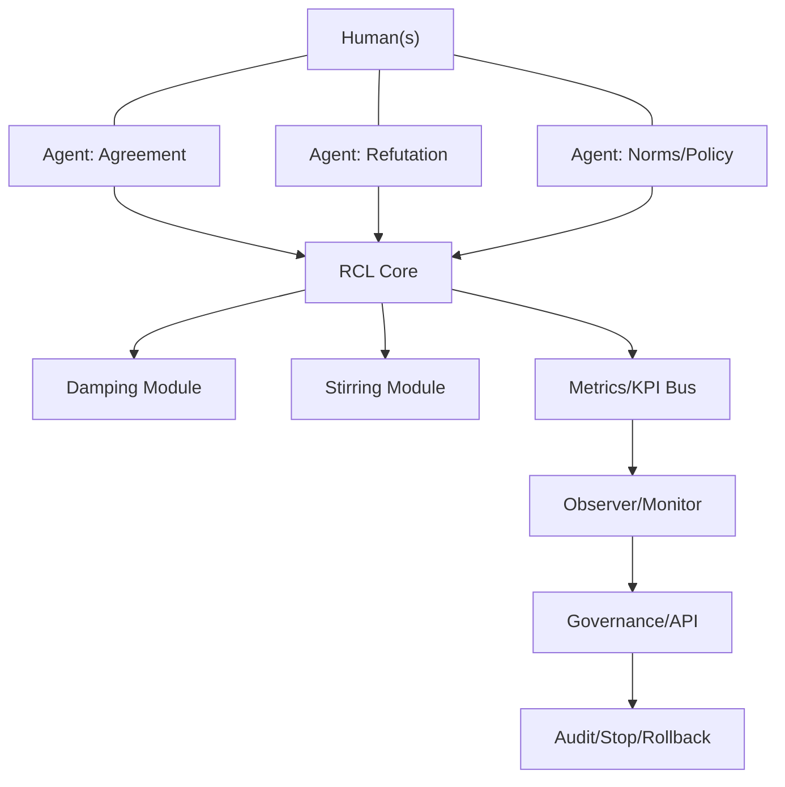
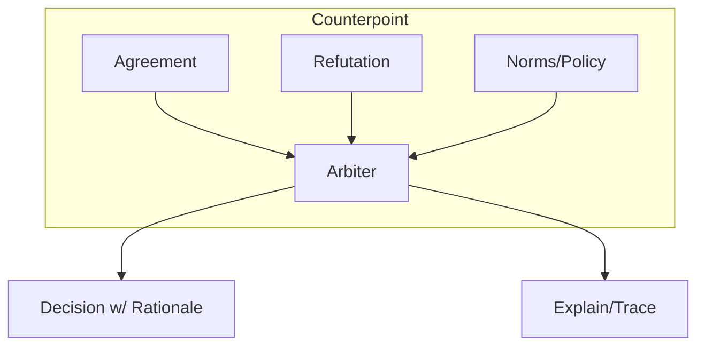
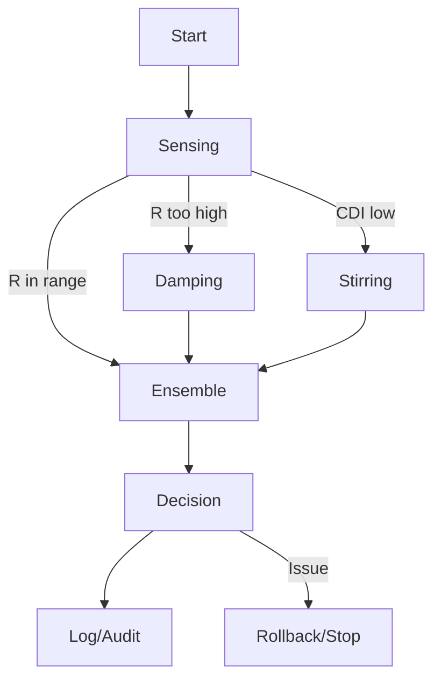

# Resonanceverse 実装論：共鳴制御（RCL）拡張設計 v0.1

> 知性は共鳴を媒介に成熟する。ただし健全な共鳴は、常に「制御された非共鳴（damping／stirring）」を内包する。

---

## 0. 目的と位置づけ（Resonanceverse拡張）

* 本ドキュメントは、Resonanceverse（RET）における**共鳴制御ループ（Resonance Control Loop; RCL）**の実装仕様をまとめる。
* ねらい：人間×AI×AI の**多主体（multi-agent / multi-human）**協働において、暴走（runaway）を避けつつ、創発（emergence）を持続的に引き出す。
* 方針：**制御理論＋多主体設計＋制度工学**の合奏として、MVP→β→運用の導線を敷く。

---

## 1. 設計原則（Principles）

1. **Resonance First**：知性を「相互予測・相互修復の振動系」とみなし、共鳴の質を一次目的とする。
2. **Damping & Stirring**：過剰同調を抑制（減衰）し、多様性を周期注入（攪拌）して**不合意帯域**を維持する。
3. **Corrigibility by Design**：可補正性（訂正受容性）を目的関数とAPIに内蔵する。
4. **Counterpoint Ensemble**：単一モデルではなく**合議制（weighted ensemble）**で意思決定する。
5. **Auditability & Accountability**：第三者監査・停止権・事故報告を標準インタフェース化する。

---

## 2. システム全体像（High-level）

---

## 3. 共鳴制御ループ（RCL）

### 3.1 センシング

* **共有前提一致率**：会話・作業文脈の前提一致程度。
* **相互予測精度**：人間→AI／AI→人間の意図・次発話・行動の予測精度。
* **収束時間**：誤解検知から再合意までの時間（修復遅延）。
* **出力変動度**：微小分布外入力に対する出力の不安定性。

### 3.2 制御

* **Damping（減衰）**：

  * 相関・同調が閾値超過で**ノイズ注入**／**温度上げ**／**探索再初期化**。
  * **レートリミット**（意思決定の最終化に待機時間を挿入）。
* **Stirring（攪拌）**：

  * 価値観・役割・データ分布の**多様性サンプル周期投入**。
  * **異論エージェント**を常設（反証・逸脱の意図的生成）。

### 3.3 出力確定

* **Weighted Ensemble**：合意追求／反証追求／規範監督の3系を加重統合。
* **信頼境界**：合意の確度・説明可能性・影響範囲でゲートし、必要に応じ**段階確定**（暫定→本決定）。

---

## 4. KPI（計測指標）

| 指標             | 定義           | 目標レンジ   | 備考        |
| -------------- | ------------ | ------- | --------- |
| **R（共鳴係数）**    | 相互予測F1/相互情報量 | 高すぎず適正帯 | 過剰共鳴は減衰対象 |
| **T_r（修復遅延）**  | 誤解→収束の時間     | 短縮      | SLOを設定    |
| **B_d（不合意帯域）** | 建設的不一致の幅     | ゼロ回避    | 攪拌で確保     |
| **AIS**        | 分布外微擾動での出力変動 | 低減      | 安定性メトリクス  |
| **CDI**        | 合議の多様度       | 適正確保    | エージェント多様性 |

---

## 5. 多主体の対位法（Counterpoint Architecture）

* **Agreement Agent**：合意・要約・妥結案を生成。
* **Refutation Agent**：反証・代替仮説・リスク列挙を生成。
* **Norms/Policy Agent**：規範・契約・法令・倫理制約の整合チェック。
* **Arbiter**：重み学習により最終合意を算出（説明責任ログを付随）。

---

## 6. 制度工学（Governance & Safety）

* **監査ログ（不可変）**：誰が・何を・いつ・なぜ変更したかを追跡。
* **停止・ロールバック権**：APIで第三者が**即時停止**・**段階巻戻し**可能。
* **事故報告レジストリ**：事案テンプレ・再発防止SOPを公開。
* **賠償・責任**：高外部性領域では**厳格責任**ベース＋強制保険。

---

## 7. API/プロトコル仕様（抜粋案）

### 7.1 Metrics Bus（観測）

* `POST /metrics/push`：{ session_id, R, Tr, Bd, AIS, CDI, context_hash, timestamp }
* `GET /metrics/query`：集計・可視化用クエリ。

### 7.2 Control Hooks（制御）

* `POST /control/damping`：{ session_id, level, reason, ttl }
* `POST /control/stirring`：{ session_id, diversity_profile, cadence }

### 7.3 Governance

* `POST /governance/stop`：{ session_id, actor_id, reason } → **即時停止**
* `POST /governance/rollback`：{ session_id, checkpoint_id }
* `GET /governance/auditlog`：改変履歴の取得。

---

## 8. データ・評価プロトコル

* **誤解修復タスク**：人間×AI×AIで誤解を意図的に発生→修復までのR・T_r・B_dを実測。
* **分布外健全性**：小擾乱（prompt/環境）でAISを測定。
* **多様度管理**：CDIが下がった場合、攪拌カデンス自動増強。

---

## 9. 90日ロードマップ

* **0–2週**：RCL仕様固め、Metrics Busと可視化の実装、異論エージェント雛形。
* **3–6週**：三者協働サンドボックス（誤解修復・価値衝突解決）で指標収集。
* **7–10週**：レッドチーム評価、停止・ロールバックAPI、事故テンプレ整備。
* **11–13週**：β運用、事例集公開、SOP確立、外部パートナー評価。

---

## 10. リスクと対策

* **過剰減衰で創発消失**：適応的ゲイン制御（R高域のみ減衰）。
* **攪拌で収束遅延**：Cadence自動調整、重要度で重み可変。
* **監査の形骸化**：外部独立監査＋公開レジストリ義務。
* **合議の責任希薄化**：Arbiterに説明責任・証拠連結を強制。

---

## 11. 実装メモ（RET接続）

* **RET-6軸**：価値／安全／説明／多様／効率／責任をRCLパラメタに写像。
* **PoP-UID/UID-DAO**：停止権・監査権限に紐づく主体認証を統合。
* **KMCS/Kotone**：エッジ側は軽量RCL（局所Damping/Stirring）＋クラウド側で合議。

---

## 12. 用語簡易集

* **R（共鳴係数）**：相互予測の良さ。高すぎは危険信号。
* **T_r（修復遅延）**：誤解の回復速度。
* **B_d（不合意帯域）**：健全な不一致の幅。
* **AIS**：整合不安定性の指標。
* **CDI**：合議多様性の指標。

---

### 付録A：RCLの簡易状態遷移

---

*© 2025 Tomoyuki Kano / Resonanceverse. CC BY-SA 4.0.*
