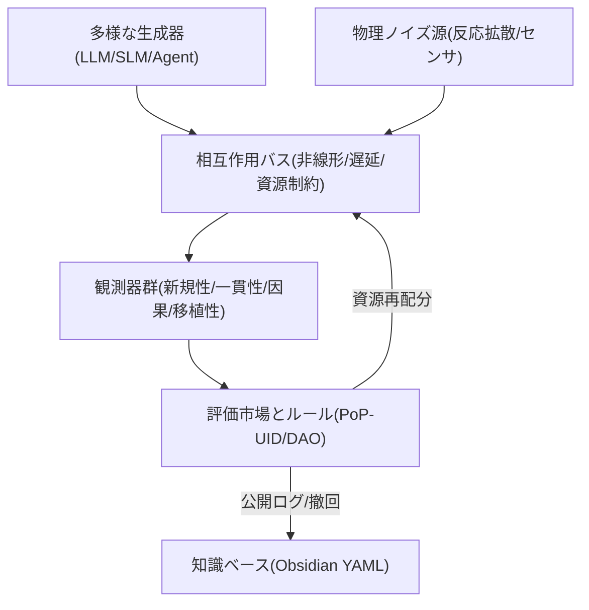

## 0. 要旨（Executive Summary）

創発を“現象”として眺めるのではなく、設計可能な相（phase）として扱う。ソフト（AI・アルゴリズム）/ハード（物理・材料）/制度（人・ルール・評価）の三層を観測→介入→再配分でループさせ、位相境界を探索・固定する。初期フェーズはソフト×制度を起点に、ハードは乱れ（ノイズ）注入口として最小接続する。

## 1. 背景と目的

* 背景：従来のLLM/Agent系は性能最大化に集中し、**位相遷移**や**多安定性**といった創発シグナルの体系的観測が不足している。
* 目的：創発の**検出**・**制御（介入）**・**利用（移植）** までを一貫する“共鳴場（Resonant Field）”を設計し、運用手順を文書化する。
* 成果物：PoC実装、観測ダッシュボード、YAMLベースの再現ログ、評価市場（資源再配分）ルール。

---

## 1.1 創発の定義（本実験）

**作動的定義（operational definition）**： 本実験における「創発」とは、(i) 局所規則と資源制約の下での相互作用から、(ii) 個別エージェントやその凸結合（単純混合）では説明困難なマクロ秩序が生成し、(iii) そのマクロ秩序が介入（intervention）に対して安定な因果応答を示す状態を指す。

言い換え：単なる“面白い挙動”ではなく、混合基準線（mixture baseline）を統計的に上回る新規性を持ち、かつ粗視化（coarse-graining）で予測能力が増すような「位相（phase）」の成立である。

**検証基準（最小セット）**：

1. 新規性の凸結合破り：観測系列と混合基準線 Q=Σ w_k P_k との乖離 D_KL(P_X || Q) がしきい値 τ_N を超える。
2. 因果整合：マクロ変数 M（例：合意度、プロトコル位相）への介入で、期待値差 ΔE=E[Y|do(M=m1)]−E[Y|do(M=m0)] が有意（> τ_C）。
3. 粗視化での情報利得：粗視化モデルの効果的情報（Effective Information; EI）が微視モデルを上回る（EI_macro − EI_micro > τ_E）。
4. 多安定/臨界徴候：同一初期条件で異相へ分岐（分岐率>τ_B）またはイベントサイズ分布にパワー則尾が出現。

各閾値 τ_* は実験ごとに前登録（preregister）し、偽陽性を抑制する。

---

## 1.2 理論的説明（枠組）

### **A. 統計物理 × 情報理論**

* 位相遷移：資源帯域・遅延・ノイズ強度などの制御パラメータが臨界を跨ぐと秩序が質的転換。有限サイズ系では臨界様スパイクと多安定性として観測される。
* 情報の粗視化利得：多体相互作用では、適切な粗視化で因果効率（EI）が上昇し、「マクロ法則の方が説明力が高い」領域（因果的創発）が生じうる。

### **B. 計算論（エージェント相互作用）**

* 非線形結合＋資源制約により、通信路の競合が勝者強化やスパース同期を誘起し、ノイズ駆動で局所最適から脱出しつつ自己組織化が進む。
* 遅延/記憶がヒステリシス（履歴依存）を生み、多安定相の土台となる。

### **C. 制度詩学（選択圧の設計）**

* 評価市場は意味の選択圧を形成し、スコア→計算資源の再配分がマクロ秩序の保持/破壊を制御。反証手続きは負のフィードバックとして過学習を抑制する。

---

## 1.3 代替仮説と反証可能性

* 代替仮説H0-1（混合で説明）：観測はエージェント出力の凸結合で説明可能 → D_KL(P_X || Q) が小さければH0-1支持。
* 代替仮説H0-2（単純ノイズ）：新規性はノイズ由来 → 介入でマクロ応答が消え、EI利得が非有意ならH0-2支持。
* 代替仮説H0-3（測度アーチファクト）：特定指標だけが上がる → 指標バンドル（新規性/因果/移植性）が同時に閾値越えしないなら創発主張は撤回。

**反証プロトコル**：

1. 事前登録パラメータで「シャッフル基準」（相互作用を壊す）とアブレーション（結合/遅延/資源の除去）を実施。
2. マクロ変数への介入実験で下向き因果（downward causation）の有無を評価。

---

## 1.4 測定と推定（実装メモ）

* 新規性：アーカイブ埋め込み最近傍半径/対数尤度。N_t = 1 − max_j cos(e_t, e_j)。
* 混合基準線：独立推論器の重み学習で Q を推定し、D_KL(P_X || Q) を算出。
* EI近似：状態空間の粗視化（k-means/プロトコル位相）後に EI ≈ I(M_t; M_{t+1}) − I(M_t; M_{t+1} | do(U)) を近似推定。
* 因果応答：介入A/B/Cの平均処置効果（ATE）とブートストラップ信頼区間。

---

## 1.5 成立条件（十分/必要の目安）

* 必要条件：異質性・非線形結合・遅延/記憶・資源制約のうち少なくとも二項目が有意水準で存在。
* 十分条件（実務的）：上記に加え、評価市場の再配分係数が臨界近傍で調整され、{τ_N, τ_C, τ_E} を同時超過する観測窓が継続的に出現。

---

## 2. 三層モデル（Resonant Field）

## 2.1 ソフト層（AI・アルゴリズム）

**目的**：小規模ルール・遅延・資源制約の組合せでマクロ秩序が跳ぶ条件を探索。 **設計パラメータ**：

* 「異質性」：モデル種別/温度/記憶長/報酬設計の多様化
* 「非線形結合」：局所注意の偏り、勝者強化、スパース通信
* 「遅延とメモリ」：短期/長期バッファ、可塑性学習率のスケジューリング
* 「資源制約」：トークン/計算/帯域の配分とペナルティ
* 「ノイズ注入」：摂動（perturbation）・ドロップアウト的乱れ

**観測KPI（最小）**：

* 新規性：埋め込み空間での既知群からの距離（cosine/NN半径）
* 一貫性：自己整合性（反証プロンプトでの崩れ率）
* 因果性：介入前後の帰結差分（A/B/Cインターベンション）
* 移植性：タスク転地時の性能維持

## 2.2 ハード層（物理・自動化ラボ）

**目的**：現実起因の乱流を注入して閉じ系化を防ぐ。 **構成例（当面）**：

* 反応拡散の物理/数理模倣（Gray–Scott GPUシミュ、将来はBZ反応・Physarum）
* センサ・アクチュエータ・ループ（Raspberry Pi 5/Jetson＋カメラ/環境センサ）
* データストリーム（画像・音・温湿度・ランダムEMノイズ）

## 2.3 制度層（人・ルール・評価＝制度詩学）

**目的**：何を価値とみなすか＝**意味の選択圧**を社会的に与える。 **最小構成**：

* PoP-UID（Proof-of-Personhood/存在証明）による参加識別
* マイクロDAO（提案→反証→改良の手続き）
* 評価市場：仮説/ツール/データに評判スコア→**計算枠の再配分**
* 倫理ガード：公開ログ、撤回規程、再現ノート（Obsidian YAML）

---

## 3. 全体フロー



---

## 4. PoC最小構成（MVP-4）

1. **Multi-Agent Sandpit**：異質な生成器群＋資源トークン（計算/通信）。
2. **Perturbation Orchestrator**：遅延/帯域/ノイズ/部分観測のスケジューラ。
3. **Observer Suite**：新規性/一貫性/因果/移植性の自動計測と時系列板。
4. **Micro-Institution**：PoP-UID参加、反証投票、計算枠の市場再配分。全ログYAML永続化。

---

## 5. 2週間スプリント（JST）

* Day 1–2：環境起工（リポ雛形、Observer最小：埋め込み距離・反証率）
* Day 3–5：Multi-Agent最小系（2–3系統＋資源トークン）
* Day 6–7：Perturbation注入（遅延/帯域/ノイズのグリッドスイープ）
* Day 8–10：Micro-Institution（反証→評価→再配分の一巡、PoP-UID最小）
* Day 11–14：分析・縮退耐性（A/B/C介入、再現YAML、ハード模擬入力）

---

## 6. 実験プロトコルと指標

### 6.1 創発シグナル（検出基準）

* 臨界様スパイク：新規性スコア分布のパワー則尾
* 多安定性：同一初期条件からの分岐率
* 介入可逆性：微小介入で相が跳ぶ/逆介入で復帰する境界

### 6.2 失敗の健全性

* 反証プロンプト崩れ率の常時可視化
* 撤回ログと再学習ルートの制度化

---

## 7. 早期に効く3実験（E-α）

* **E1: 資源制約下の協調–競合相転移**

  * 通信帯域を段階的に絞り、合意形成タスクの性能曲線を計測
* **E2: 反応拡散モック→意味パターン転写**

  * Gray–Scott画像を入力、エージェント間プロトコルに“形態拘束”が生じるか観測
* **E3: 評価市場フィードバック強度スイープ**

  * 評価→計算枠の再配分係数を掃き、創発シグナル強度の増減を測る

---

## 8. リスクと回避策

* 内輪の自己強化ループ：外部ノイズ（ハード/人）定期注入、反証役を制度で確保
* メトリクス過適合：新規性指標のマルチ化（埋め込み距離＋n-gram希少度＋行動多様性）
* 倫理・安全：公開・撤回・説明責任の“詩学”をルールに組込み

---

## 9. データモデル（YAML/JSON雛形）

## 9.1 実験ログ（YAML）

```yaml
experiment_id: RF-E1-2025-09-28-01
created: 2025-09-28T05:10:00+09:00
researchers: ["PoP:did:xyz:alice", "PoP:did:xyz:bob"]
setup:
  agents: ["LLM_A@T=0.7", "SLM_B@T=1.1", "ToolAgent_C"]
  constraints:
    token_budget: 8192
    comm_bandwidth: ["200kbps","100kbps","50kbps"]
    latency_ms: [0, 150, 500]
  perturbations: ["dropout@0.1", "masking@20%"]
metrics:
  novelty_cosine_nn: 0.42
  self_contradiction_rate: 0.18
  causal_effect_delta: 0.27
  portability_score: 0.61
outcomes:
  phase: "bistable"
  notes: "帯域100kbps付近で新規性スパイク。反証で一度崩壊→再配分後に回復。"
repro:
  seed: 123456
  code_rev: "git:abcd1234"
  data_hash: "sha256:..."
ethics:
  consent: "public-logs"
  retractable: true
```

## 9.2 評価市場ルール（JSON）

```json
{
  "scoring": {"novelty": 0.35, "consistency": 0.25, "causality": 0.25, "portability": 0.15},
  "allocation": {"compute_quanta": "score * k", "bandwidth_quanta": "score * m"},
  "governance": {"proposal": "PoP-UID", "challenge_window_h": 24, "retract_rule": "any-time-with-log"}
}
```

---

## 10. 実装方針（最小リポ構成）

```text
resonant-field/
 ├─ apps/
 │   ├─ agents/            # LLM/SLM/Tool Agents
 │   ├─ orchestrator/      # 遅延/帯域/ノイズ スケジューラ
 │   └─ observers/         # 指標計測（API＋バッチ）
 ├─ services/
 │   ├─ market/            # 評価→資源再配分（Micro-DAO）
 │   └─ pop_uid/           # PoP-UID (最小DID実装)
 ├─ data/
 │   └─ streams/           # 入力ストリーム（模擬/実測）
 ├─ docs/
 │   └─ playbooks/         # 実験手順/撤回規程
 └─ logs/
     └─ yaml/              # 実験ログ（再現可能性）
```

---

## 11. 倫理・公開・撤回の運用（制度詩学）

* **公開**：観測値と設定を原則公開（個人情報・安全配慮をマスク）
* **撤回**：研究者/参加者のいずれからも撤回可能、履歴は“理由付き”で残す
* **説明**：失敗を含む物語化（制度詩学としての“共有可能な後悔”）

---

## 12. ロードマップ

* v0.1：ソフト×制度で位相境界の探索開始、ハードは模擬入力
* v0.2：実センサ入力接続、評価市場の重み学習（ベイズ更新）
* v0.3：物理エージェント（反応拡散/BZ/Physarum）との往復学習

---

## 付録A：用語メモ

* **位相遷移**：制御パラメータの閾値を跨ぎ系の秩序が質的転換
* **多安定性**：同条件でも複数の安定状態が共存
* **介入（intervention）**：因果推論のための操作

## 付録B：参考（更新予定）

* 反応拡散（Gray–Scott）/BZ反応/Physarum文献
* 反証駆動評価、因果推論（介入）関連
* マルチエージェントと資源配分・市場設計

---

## 13. 外部評価（Claude）サマリーと反映計画

## 13.1 要点サマリー

* **理解/共鳴/検証可能性 いずれも高評価**（信頼性85%）。
* **強み**：作動的定義・三層モデル・反証可能性・2週間MVP。
* **統合提案**：Resonanceverseの6軸動的選択・朧（Oboro）機能・疑似ベイズ統合の組込み。
* **課題指摘**：①スケーラビリティ（O(N²)通信）、②創発の再現性の定義、③予期せぬ創発への停止プロトコル。

## 13.2 設計への反映（v0.2 変更案）

1. **EI（Effective Information）推定の具体化**

   * 状態粗視化：k-means/k-medoids + プロトコル位相の二系統で併用。
   * 推定式：EI ≈ I(M_t; M_{t+1}) − I(M_t; M_{t+1}|do(U)) をバギング推定。
   * 検定：ブートストラップCIとランダム化検定を併用。
2. **閾値 τ の初期設定**

   * τ_N, τ_C, τ_E, τ_B をベイズ事前で設定し、週次で事後更新（偽陽性制御のため事前登録）。
3. **停止プロトコル（Safety Kill-Switch）**

   * 連続窓での危険指標上振れ（例：自己相関>0.95×K連続、想定外プロトコル発話率>θ）で、自動停止→人手レビュー→再開条件明示。
4. **スケーラビリティ対策**

   * スパース相互作用（近傍k通信・確率ルーティング）と**トピック分割バス**導入で O(N log N) へ近似。
   * **Thompson Sampling** による相互作用サブセット選択をOrchestratorに追加。
5. **再現性の定義**

   * 個別トレースの一致ではなく**分布レベルの再現**（創発率・分岐率・EI利得の分布が一致）を合格基準に採用。
6. **制度層の強化**

   * 反証役のローテーションを制度化、PoP-UIDに基づく評価市場の**挑戦権**を常設。

## 13.3 実験追加（E-β）

* **E4: スパース通信 × 評価市場係数スイープ**
  k-近傍通信（k∈{2,4,8}）と再配分係数の格子探索で位相地図を作成。
* **E5: 停止プロトコルバリデーション**
  擬似異常（急峻なプロトコル逸脱）を挿入し、Kill-Switch感度/特異度を測定。
* **E6: 6軸動的選択（疑似ベイズ）A/B**
  6軸選択ON/OFFで創発率・EI利得・計算効率を比較（事前仮説：ONで創発率↑、計算時間↓）。

## 13.4 リポ構成追補

* `apps/orchestrator/selector/` に **thompson_selector.py** を追加。
* `services/market/` に **challenge_queue/**（挑戦権のキュー）を追加。
* `docs/playbooks/` に **safety_kill_switch.md** を追加（発火条件・手動解除手順）。

## 13.5 ロードマップ更新

* **v0.2**：E4–E6の実行、EI推定の安定化、停止プロトコル導入。
* **v0.3**：実センサ入力 × 6軸動的選択の結合、分布再現性の第三者評価。

---
