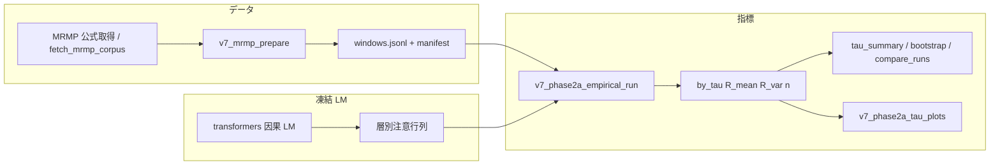

# Phase II-A — 理論↔数値対応・接続点・データ前提（索引）

本稿は [実装マスタープラン](v7_phase2a_implementation_master_plan.md) を補う**設計索引**である。**短い対応表の正本**はマスタープラン §2。ここでは**実装への落とし込み**（スクリプト・フィールド）・**モジュール境界**・**MRMP・審判・ローカル SLM**の前提を横断して示す。

| 参照先 | 役割 |
|--------|------|
| [v7_phase2a_theory_bridge.md](v7_phase2a_theory_bridge.md) | コーパス R(τ) と τ*／τ*_exp の区別 |
| [v7_phase2a_numeric_tau_exp.md](v7_phase2a_numeric_tau_exp.md) | 合成 τ 掃引・スタブの操作定義 |
| [v7_corpus_MRMP.md](v7_corpus_MRMP.md) | MRMP のみ・取得・ライセンス |
| [v7_local_slm_m3_japanese_plan.md](v7_local_slm_m3_japanese_plan.md) | ローカル SLM・審判役割分離 |
| [rvt_exp_2026_008_architecture_bridge.md](rvt_exp_2026_008_architecture_bridge.md) | RVT-008 と本リポ（L1–L3） |
| [experiments/README.md](../../experiments/README.md) | スクリプト索引 |
| [v7_phase2a_theoretical_tau_bridge_appendix_ja.md](v7_phase2a_theoretical_tau_bridge_appendix_ja.md) | 理論 τ* と delay_sweep の**同一視ゲート**・チェックイン手順 |

---

## 1. 理論 ↔ 数値対応表（実装の設計図・拡張）

マスタープラン §2 の行を、**リポジトリ上の実体**まで伸ばした表。新規パラメータや項を足すときは **§2 に 1 行追加**し、必要なら本表の「実装メモ」列も同じ PR で更新する。

| 理論・設計書側 | コード・成果物 | 実装メモ |
|----------------|----------------|----------|
| 連続時間の遅延 τ | `experiments/v7_phase2a_delay_sweep.py` の整数 `tau`（履歴リング長） | `dt` は積分ステップ。論文・付録で **連続 τ ↔ 離散ラグ**の対応を一文宣言する。 |
| 強凸性 μ（設計書） | 合成では減衰係数 `alpha`；`--alpha-list` で感度 | `C_synthetic_sensitivity_mu_proxy` レール。α を μ の**離散代理**とみなすときはスケール根拠を文書化。 |
| V_K（Lyapunov–Krasovskii 系） | `simulate_tau_v_k_series`（`krasovskii_gamma` 任意） | W\*=0 仮定。段階 2 は**離散遅延和**のみ。W_D\* 一般・連続積分の厳密形は未。 |
| dV_K/dt の符号 | `v7_phase2a_tau_exp_lyapunov_stub.py` の尾区間 ΔV 統計 | **連続時間の符号ではない**。`tau_exp_numeric_stub_*` は別ラベル。 |
| τ*_exp（設計書 §3.1 手続き） | 完成実装は**未**。スタブのみログ化 | [v7_phase2a_numeric_tau_exp.md](v7_phase2a_numeric_tau_exp.md) の操作定義に従う。 |
| 理論 τ* | `v7_phase2a_paper_tau_comparison.py` ＋ [`v7_phase2a_theoretical_tau_reference_v1.json`](v7_phase2a_theoretical_tau_reference_v1.json) | リポジトリは自動算出しない。provenance 必須。 |
| DDRF 連続 τ*（定理3.3・ホプフ） | 上記 JSON の `theoretical_tau_star`（未確定時 null）＋ [付録・導入手順](v7_phase2a_theoretical_tau_bridge_appendix_ja.md) | `delay_sweep` と**同型宣言＋数値導出**が揃うまで注入しない。乖離％の本番主張はゲート後。 |
| MRMP 上の注意統計・R(τ) | `v7_phase2a_empirical_run.py` → `by_tau`（`R_mean`・`R_var`・`n`） | 凍結 LM・話者ブロック Frobenius。レール **B**。定理 τ* と**非同一視**。 |
| コーパス上 τ 候補 | 事前登録 `span_spec`・Var 規則・`tau_star_corpus_proxy` | [v7_phase2a_prereg_v1.json](v7_phase2a_prereg_v1.json)。主解析の機械候補は探索的。 |
| 6 軸（信頼・権威 等）と遅延一貫性 | `auxiliary_label_delay_coherence`（任意で empirical JSON に同梱） | 審判スコアが入力に**あるときのみ**。主 R(τ) とはスケール非互換→補助レール。 |

---

## 2. アーキテクチャ上の接続点（データとモジュールの境界）

「どこからどこへ何が流れるか」を固定する。**混線しやすい箇所**を接続点として明示する。

### 2.1 レール B（MRMP → 実証 JSON → 図表）

- **接続点 A**: `windows.jsonl` のスキーマ・行数・SHA256（`empirical_run` JSON に `windows_jsonl_sha256`）。
- **接続点 B**: モデル ID・`hf_revision`・層 index・デバイス文字列（再現ログに必須）。
- **接続点 C**: 主解析 `by_tau` と補助 `auxiliary_label_delay_coherence` は**別系列**（橋ドキュメントどおり）。

### 2.2 レール A / C（合成テンソル）

- **入口**: 乱数シード・`N,d,steps,dt,alpha,beta,noise,tau_max`（`delay_sweep` JSON にそのまま残る）。
- **束ね**: `v7_phase2a_theory_bridge_synth.py` が単発掃引（A）と α スイープ（C）を 1 JSON にまとめる。
- **論文表**: `v7_phase2a_paper_tau_comparison.py` が Lyapunov スタブ・振動代理・理論注入・MRMP プレースホルダ行を**同じ表形式**で並べる（`rail_ids` で混線防止）。

### 2.3 レール E（RVT-008）

- **計画 JSON**: `rvt_exp_2026_008_ablation_runner.py`（`rail_id`: `E_RVT_008_ablation_plan`）。
- **実行接続**: `mrmp_row`・`attn_inject`・Day0・Oboro は [架け橋](rvt_exp_2026_008_architecture_bridge.md) のスクリプト表に従う。Phase II-A の `empirical_run` と**同じ windows.jsonl**を参照しうるが、L2 介入経路は**別 CLI**（`--rvt-l2-mode` 等）。

### 2.4 レール D（Phase IV 最小束ね）

- `v7_phase4_minimal_repro.py` が `two_tier_sweep`（＋任意 squad_span 等）を**1 JSON**に載せるだけ。本番 Phase IV 全体の**代替ではない**。

---

## 3. データとインフラ前提

### 3.1 MRMP（本番コーパス）

- **正本**: [v7_corpus_MRMP.md](v7_corpus_MRMP.md)（**MRMP のみ**・CC BY-SA 4.0）。
- **整形**: `experiments/v7_mrmp_prepare.py` → 既定 `experiments/logs/mrmp_prepared/windows.jsonl`（git 管理外想定）。
- **健全性**: `rvt_exp_2026_008_day0_checks.py --strict-manifest`（事前登録・ロードマップに記載の手順と整合）。
- **再現**: 実行ログに **jsonl パス・SHA256・窓仕様**を残す（`empirical_run` が `windows_jsonl_sha256` を記録）。

### 3.2 審判（LLM judge）

| 用途 | 主なスクリプト | 備考 |
|------|----------------|------|
| Phase I-A パイロット 6 軸 | `experiments/v7_phase1a_llm_judge_six_axes.py` | API またはローカル。ラベルは `PILOT_KEYS` と整合。 |
| MRMP チャンク審判（追記） | `experiments/run_mrmp_llm_judge_chunks.sh` 等 | 長文化・コスト管理はシェル環境変数で。 |
| RVT 軸マッピング | `experiments/rvt_exp_2026_008_judge_axis_mapping.py` | 外部計画の 6 軸・L2 条件との対応。 |
| ローカル SLM 審判プラン | [v7_local_slm_m3_japanese_plan.md](v7_local_slm_m3_japanese_plan.md) §2 | Swallow-7B 等・**注意系と役割分離**。 |

**前提**: 審判出力は **MRMP 実データレールの補助**であり、合成の τ*_exp や理論 τ* の**代替にならない**（マスタープラン §1・橋ドキュメント）。

### 3.3 ローカル SLM・実行環境

- **正本**: [v7_local_slm_m3_japanese_plan.md](v7_local_slm_m3_japanese_plan.md)（M3 Max / 128GB 想定、**他マシンでも手順は流用可**）。
- **スモーク**: `experiments/v7_local_env_check.py`（torch / transformers メタ）。
- **任意チェックリスト**: `experiments/v7_local_optional_checklist.py`（トークン有無・MPS 等、**秘密を出さない**）。
- **HF キャッシュ**: `HF_HOME`・ディスク目安は同プラン §0 補足。CI 本番ログとは**別マニフェスト**でよいが、論文用再現では環境を固定する。

---

## 4. メンテナンスルール

1. **対応表**の変更はマスタープラン §2 を先に更新し、本稿 §1 の拡張表を**同じ PR**で揃える。  
2. **新しい接続点**（新 JSON スキーマ・新レール）ができたら §2 の図表か箇条書きを 1 ブロック追加する。  
3. **インフラ**の前提変更（モデル既定・必須チェック）は `v7_local_slm_m3_japanese_plan.md` または `v7_corpus_MRMP.md` を正とし、本稿 §3 は**リンクと一行要約**に留めるか、差分が大きいときのみ追記する。

---

*索引の追加のみでマスタープランの revision を上げる必要はない。事前登録 JSON に本ファイルを載せる場合は `v7_phase2a_prereg_v1.json` の revision を上げる。*
